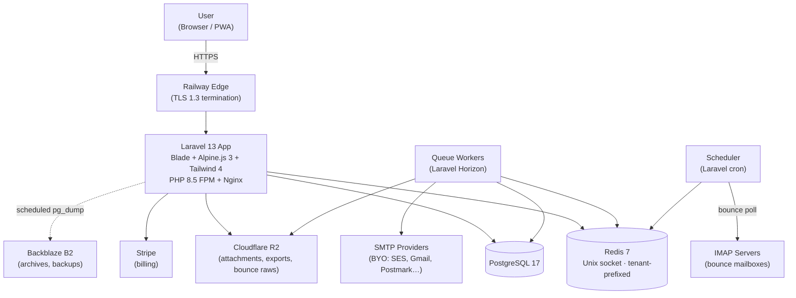
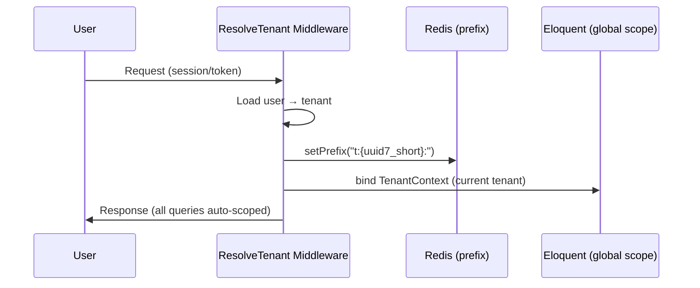
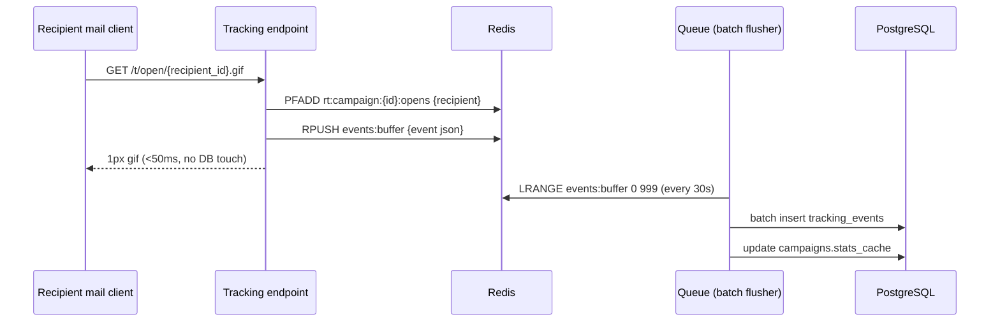
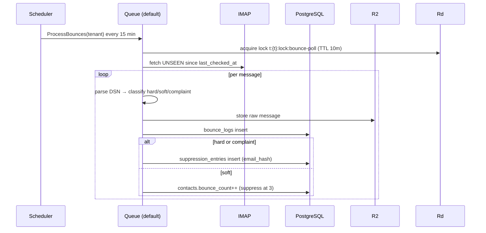

# 02 — Technical Architecture

**Status:** Draft | **Decisions:** [README Decision Log](README.md#decision-log)

---

## 1. System Context



---

## 2. "20-not-200" Architecture Principles

These rules keep the codebase minimal, scannable, and maintainable. Violations require justification in PR.

1. **Invokable Actions for complex operations.** One class, one `__invoke()`, one test. `App\Actions\SendCampaignBatch`, `App\Actions\ProcessBounces`, `App\Actions\ImportContacts`.
2. **No repository pattern.** Eloquent IS the data layer. Reusable constraints become query scopes (`scopeActive`, `scopeHealthy`).
3. **No service classes for CRUD.** Controllers handle simple CRUD directly: validate via Form Request → `Model::create($validated)` → return Resource.
4. **Route model binding + implicit tenant scoping.** No manual `findOrFail`; the global scope makes cross-tenant access 404 automatically.
5. **Global tenant scope via `HasTenant` trait.** Applied once at model boot. `tenant_id` auto-set on create. Zero `where('tenant_id', …)` in application code.
6. **Event-driven side effects.** `CampaignCompleted → NotifyOwner, UpdateTenantUsage, FireWebhook`. No nested if-chains after mutations.
7. **Form Requests for all validation.** Zero validation logic in controllers.
8. **API Resources for all output.** Zero manual array shaping.
9. **Enums for status fields.** `CampaignStatus::Sending`, not `'sending'` strings.
10. **Constructor property promotion + readonly** everywhere (PHP 8.5).

**Canonical example — creating a campaign (the whole feature):**

```php
// app/Http/Requests/StoreCampaignRequest.php — validation lives here
class StoreCampaignRequest extends FormRequest
{
    public function rules(): array
    {
        return [
            'name'      => ['required', 'string', 'max:120'],
            'subject'   => ['required', 'string', 'max:200'],
            'body_html' => ['required', 'string'],
            'list_id'   => ['required', 'exists:contact_lists,id'],
        ];
    }
}

// app/Http/Controllers/CampaignController.php — the entire store action
public function store(StoreCampaignRequest $request): CampaignResource
{
    $campaign = Campaign::create($request->validated()); // tenant_id auto-set

    CampaignCreated::dispatch($campaign); // listeners: build recipient queue, notify

    return new CampaignResource($campaign);
}
```

3 files, ~20 lines of actual logic. That is the standard.

---

## 3. Multi-Tenancy Architecture

### 3.1 Resolution flow



### 3.2 `HasTenant` trait (the entire tenancy mechanism)

```php
trait HasTenant
{
    public static function bootHasTenant(): void
    {
        static::addGlobalScope('tenant', fn (Builder $q) =>
            $q->where('tenant_id', TenantContext::id())
        );

        static::creating(fn (Model $m) =>
            $m->tenant_id ??= TenantContext::id()
        );
    }
}
```

### 3.3 Isolation layers (defense in depth)

| Layer | Mechanism |
|-------|-----------|
| HTTP | `ResolveTenant` middleware sets context before any controller runs |
| Eloquent | Global scope on every tenant model — cross-tenant = 404 |
| Redis | Per-tenant prefix `t:{uuid7_short}:` — keys physically separated |
| Queue | `tenant_id` in every job payload; worker re-binds context + prefix before `handle()` |
| Cache | Inherits Redis prefix automatically |
| Tests | Automated cross-tenant access suite — every model, every endpoint (see Coding Standards) |

`uuid7_short` = first 8 chars of tenant UUID (e.g., `0192ab3c`). Unambiguous within a Redis instance, keeps keys short.

---

## 4. Redis Architecture — Unix Socket + Tenant Prefix

### 4.1 Connection (local / Docker)

```ini
# redis.conf (Sail container)
unixsocket /var/run/redis/redis.sock
unixsocketperm 770
port 0                       # TCP disabled locally
```

```php
// config/database.php
'redis' => [
    'client' => 'phpredis',
    'default' => [
        'scheme' => env('REDIS_SCHEME', 'unix'),       // 'unix' local, 'tcp' on Railway
        'path'   => env('REDIS_SOCKET', '/var/run/redis/redis.sock'),
        'host'   => env('REDIS_HOST', '127.0.0.1'),    // used when scheme=tcp
        'port'   => env('REDIS_PORT', 6379),
        'password' => env('REDIS_PASSWORD'),
    ],
    'cache' => ['database' => 1] + /* same connection */,
    'queue' => ['database' => 2] + /* same connection */,
],
```

- **Local/Sail:** Unix socket via shared volume between `app` and `redis` containers. No TCP.
- **Railway:** Managed Redis is TCP-only; app switches via `REDIS_SCHEME=tcp`. **Prefix strategy is identical** — isolation never depends on transport.
- Health check fails loudly if the configured transport is unavailable. No silent fallback.

### 4.2 Key conventions

```
t:{tenant_short}:cache:campaigns:list
t:{tenant_short}:cache:dashboard:stats
t:{tenant_short}:rate:api:{user_id}
t:{tenant_short}:lock:bounce-poll
t:{tenant_short}:rt:campaign:{campaign_id}:opens      # HyperLogLog unique opens
t:{tenant_short}:rt:campaign:{campaign_id}:clicks     # HyperLogLog unique clicks
t:{tenant_short}:usage:emails:{YYYY-MM}               # plan enforcement counter

global:plans                                          # plan definitions (all tenants)
global:rate:ip:{ip}                                   # pre-auth rate limiting
```

Rules: every tenant key prefixed (enforced by middleware), every cache key has a TTL, real-time counters use HyperLogLog/sorted sets (not string counters) for memory efficiency.

### 4.3 Real-time analytics pipeline



Tracking endpoints never touch PostgreSQL synchronously. Dashboard reads `stats_cache` JSONB + Redis counters.

---

## 5. Component Map

| Component | Responsibility | Implementation |
|-----------|---------------|----------------|
| HTTP layer | Routing, middleware, Form Requests, Resources | Laravel standard |
| Domain actions | Complex operations | `App\Actions\*` invokables |
| Domain events | Side effects | Events + Listeners |
| Models | Data + scopes + relationships | Eloquent + `HasTenant` |
| Queue | Sending, imports, bounce processing, webhooks | Horizon, Redis driver |
| Scheduler | Bounce polls, usage resets, report rollups | Laravel cron |
| Storage | Attachments, exports, bounce raws | R2 (S3-compatible) via Flysystem |
| Billing | Subscriptions, plan gates | Cashier + middleware |

### Queue lanes

| Lane | Jobs | Priority |
|------|------|----------|
| `high` | Campaign send batches, test sends | Immediate |
| `default` | Imports, exports, bounce processing | Normal |
| `low` | Stats rollups, report generation, archive jobs | Deferred |

---

## 6. Data Flows

### 6.1 Campaign send

```mermaid
sequenceDiagram
    participant U as User
    participant C as Controller
    participant Q as Queue (high)
    participant P as SmtpPool
    participant S as SMTP Provider
    participant PG as PostgreSQL

    U->>C: POST /campaigns/{id}/send
    C->>PG: status → queued; dispatch BuildRecipientQueue
    Q->>PG: chunk eligible recipients (exclude suppressed)
    loop per batch of 100
        Q->>P: nextAccount() (weighted by health, daily limit)
        P->>S: send via Symfony Mailer
        alt success
            Q->>PG: recipient → sent; account sent_today++
        else failure
            Q->>P: penalize health; retry next account (max 3)
        end
    end
    Q->>PG: campaign → completed; dispatch CampaignCompleted
```

### 6.2 Bounce processing



---

## 7. Tech Stack (free-tier-first)

| Layer | Choice | Why | Cost at start |
|-------|--------|-----|---------------|
| Runtime | PHP 8.5 + Laravel 13 | JIT, fibers, modern syntax, ecosystem | Free |
| Frontend | Blade + Alpine.js 3 + Tailwind 4 | SSR speed, ~15KB JS, no SPA overhead | Free |
| Database | PostgreSQL 17 | JSONB, partitioning, MVCC | Railway free tier |
| Cache/Queue | Redis 7 (Unix socket local, TCP on Railway) | Sub-ms, reliable queues, pub/sub | Railway free tier |
| Storage | Cloudflare R2 | S3 API, zero egress | Free 10GB |
| Archive | Backblaze B2 | Cheap cold storage | Free 10GB |
| Local mail | Mailpit | SMTP/IMAP capture in Sail | Free |
| Errors | Sentry | Real signal, low noise | Free tier |
| Monitoring | Laravel Pulse + BetterStack | Built-in app metrics + uptime | Free |
| CI | GitHub Actions | 2,000 min/mo | Free |
| Billing | Stripe + Cashier | Standard, battle-tested | Per-transaction |

---

## 8. Scaling Path

| Stage | Trigger | Change |
|-------|---------|--------|
| 0 — MVP | Launch | Single Railway app + managed PG + managed Redis |
| 1 | > 50 concurrent sends | Scale Horizon workers horizontally (Railway replicas, `high` lane only) |
| 2 | > 100k emails/day | PG read replica for analytics; tracking writes already buffered |
| 3 | > 1k tenants | Partition `tracking_events` retention to B2 aggressively; dedicated Redis |
| 4 | Revenue-justified | Migrate to AWS ECS/Fargate + RDS + ElastiCache (Dockerfile is portable by design) |

---

## 9. Future-Proofing (baked in now)

| Mechanism | Enables |
|-----------|---------|
| Domain events on every mutation | Event sourcing, CQRS, outbound webhooks — no refactor needed |
| `feature_flags` table | Gradual rollout, A/B tests, plan-gating new features |
| Interface contracts (`App\Contracts\SmtpDriver`, `StorageDriver`, `AnalyticsDriver`) | Swap implementations without touching consumers |
| Queue priority lanes | Independent worker scaling per lane |
| `stats_cache` JSONB pre-computed read model | Dedicated read DB / ClickHouse later without API change |
| Versioned API namespace (`/api/v1/`) | v2 without breaking clients |
| Dockerfile environment-agnostic | Railway → Fly.io → ECS with zero code change |
