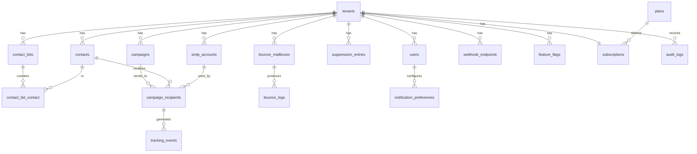

# 03 — Database Schema & Data Model

**Status:** Draft | **Engine:** PostgreSQL 17 | **PKs:** UUID v7 everywhere

---

## 1. Conventions

- **UUID v7 primary keys** — `$table->uuid('id')->primary()` populated via `Str::uuid7()`. Time-ordered (index-friendly), globally unique, non-enumerable.
- **`tenant_id uuid NOT NULL REFERENCES tenants(id)`** on every tenant-scoped table. Enforced by FK + Eloquent global scope (see Architecture §3).
- **snake_case** columns, **plural** table names.
- **Timestamps:** `created_at`, `updated_at` on all tables; `deleted_at` (soft delete) on contacts, campaigns, smtp_accounts, contact_lists.
- **JSONB** for flexible payloads: `metadata`, `settings`, `stats_cache`, `limits`, `features`.
- **Enums as strings** backed by PHP enums (check constraints optional; app-level enforced).
- **Privacy:** suppression lookups store `email_hash` (SHA-256), never plaintext.

---

## 2. ER Diagram

---

## 3. Tables

### 3.1 `tenants` — root entity (not tenant-scoped)

| Column | Type | Constraints |
|--------|------|-------------|
| id | uuid | PK (v7) |
| name | varchar(120) | NOT NULL |
| slug | varchar(60) | UNIQUE, NOT NULL |
| settings | jsonb | DEFAULT '{}' — timezone, branding, sending defaults |
| status | varchar(20) | DEFAULT 'active' — active/suspended/cancelled |
| trial_ends_at | timestamptz | NULL |
| created_at / updated_at | timestamptz | |

**Indexes:** `slug` (unique).

### 3.2 `plans` — global pricing definitions (seeded)

| Column | Type | Notes |
|--------|------|-------|
| id | uuid | PK |
| name | varchar(40) | Free/Starter/Growth/Scale/Enterprise |
| stripe_price_id | varchar(80) | NULL for Free |
| limits | jsonb | `{"emails_monthly":5000,"smtp_accounts":3,"contacts":5000,"users":2}` |
| features | jsonb | `{"bounce_processing":true,"api_access":false,"webhooks":false,"priority_queue":false}` |

Seeded values per [pricing](README.md#pricing-tiers-locked): Free 100/1/500/1 · Starter 5k/3/5k/2 · Growth 25k/10/25k/5 · Scale 100k/25/100k/∞.

### 3.3 `subscriptions` — one per tenant (Cashier)

| Column | Type | Constraints |
|--------|------|-------------|
| id | uuid | PK |
| tenant_id | uuid | FK, UNIQUE |
| plan_id | uuid | FK → plans |
| stripe_id | varchar(80) | UNIQUE, NULL on Free |
| status | varchar(30) | active/trialing/past_due/cancelled |
| current_period_end | timestamptz | |

### 3.4 `users`

| Column | Type | Constraints |
|--------|------|-------------|
| id | uuid | PK |
| tenant_id | uuid | FK, NOT NULL |
| email | citext | NOT NULL |
| password | varchar(255) | bcrypt/argon2id |
| name | varchar(120) | |
| role | varchar(20) | owner/admin/editor/viewer |
| two_factor_secret | text | encrypted, NULL |
| email_verified_at | timestamptz | NULL |
| last_login_at | timestamptz | NULL |
| created_at / updated_at | | |

**Indexes:** UNIQUE `(tenant_id, email)`; `(tenant_id, role)`.

### 3.5 `smtp_accounts` (soft deletes)

| Column | Type | Notes |
|--------|------|-------|
| id | uuid | PK |
| tenant_id | uuid | FK |
| name | varchar(80) | display label |
| host | varchar(255) | |
| port | smallint | default 587 |
| username | varchar(255) | |
| password | text | **encrypted** via `Crypt` (AES-256-GCM) |
| encryption | varchar(10) | tls/ssl/none |
| from_email | citext | |
| from_name | varchar(120) | |
| daily_limit | int | default 500 |
| sent_today | int | reset by scheduler (tenant TZ) |
| health_score | smallint | 0–100, default 100 |
| status | varchar(20) | active/paused/failed |
| last_checked_at | timestamptz | |

**Indexes:** `(tenant_id, status, health_score DESC)` — rotation query; `(tenant_id)`.

### 3.6 `contacts` (soft deletes)

| Column | Type | Notes |
|--------|------|-------|
| id | uuid | PK |
| tenant_id | uuid | FK |
| email | citext | |
| email_hash | char(64) | SHA-256 for suppression joins |
| name | varchar(160) | NULL |
| metadata | jsonb | custom fields from import mapping |
| status | varchar(20) | active/unsubscribed/bounced/complained |
| bounce_count | smallint | default 0; suppress at 3 soft |
| unsubscribed_at | timestamptz | NULL |
| created_at / updated_at / deleted_at | | |

**Indexes:** UNIQUE `(tenant_id, email)`; `(tenant_id, email_hash)`; `(tenant_id, status)`.

### 3.7 `contact_lists` + `contact_list_contact`

`contact_lists`: id, tenant_id, name, description, timestamps. UNIQUE `(tenant_id, name)`.

Pivot: `list_id` FK, `contact_id` FK, `created_at`. PK `(list_id, contact_id)`. Index `(contact_id)`.

### 3.8 `suppression_entries`

| Column | Type | Notes |
|--------|------|-------|
| id | uuid | PK |
| tenant_id | uuid | FK |
| email_hash | char(64) | **never plaintext** |
| reason | varchar(30) | hard_bounce/complaint/unsubscribe/manual |
| source | varchar(30) | bounce_processor/user/api/import |
| created_at | timestamptz | append-only, no updates |

**Indexes:** UNIQUE `(tenant_id, email_hash)`; `(tenant_id, reason)`.

### 3.9 `campaigns` (soft deletes)

| Column | Type | Notes |
|--------|------|-------|
| id | uuid | PK |
| tenant_id | uuid | FK |
| name | varchar(120) | |
| subject | varchar(200) | spin syntax supported |
| body_html | text | |
| body_text | text | NULL |
| status | varchar(20) | draft/queued/sending/paused/completed/failed |
| list_id | uuid | FK → contact_lists |
| scheduled_at | timestamptz | NULL = send now |
| settings | jsonb | rotation strategy, batch size, track opens/clicks |
| stats_cache | jsonb | pre-computed read model (sent/opens/clicks/bounces) |
| created_at / updated_at / deleted_at | | |

**Indexes:** `(tenant_id, status)`; `(tenant_id, created_at DESC)`.

### 3.10 `campaign_recipients`

| Column | Type | Notes |
|--------|------|-------|
| id | uuid | PK |
| campaign_id | uuid | FK |
| contact_id | uuid | FK |
| smtp_account_id | uuid | FK, NULL until sent |
| tenant_id | uuid | denormalized for isolation + partition pruning |
| status | varchar(20) | pending/sent/failed/bounced |
| message_id | varchar(255) | UNIQUE — tracking correlation |
| sent_at / opened_at / clicked_at | timestamptz | NULL |

**Indexes:** `(campaign_id, status)`; UNIQUE `message_id`; `(tenant_id, campaign_id)`.

### 3.11 `tracking_events` — **partitioned by month**

| Column | Type |
|--------|------|
| id | uuid |
| tenant_id | uuid |
| campaign_id | uuid |
| recipient_id | uuid |
| event_type | varchar(20) — open/click/bounce/complaint/unsubscribe |
| ip | inet |
| user_agent | varchar(512) |
| link_url | text, NULL |
| created_at | timestamptz — **partition key** |

**Partitioning:** `PARTITION BY RANGE (created_at)`, monthly partitions, 12-month retention → archived to B2 then dropped.
**Indexes (per partition):** `(campaign_id, event_type)`; `(tenant_id, created_at)`.

### 3.12 `bounce_mailboxes`

id, tenant_id, imap_host, imap_port, username, password (**encrypted**), last_checked_at, status. Index `(tenant_id)`.

### 3.13 `bounce_logs`

| Column | Type | Notes |
|--------|------|-------|
| id | uuid | PK |
| tenant_id | uuid | FK |
| bounce_mailbox_id | uuid | FK |
| email_hash | char(64) | |
| bounce_type | varchar(20) | hard/soft/complaint |
| raw_ref | varchar(255) | R2 object key, not inline |
| processed_at | timestamptz | |

**Indexes:** `(tenant_id, email_hash)`; `(tenant_id, bounce_type, processed_at DESC)`.

### 3.14 `webhook_endpoints`

id, tenant_id, url, events (jsonb array), secret (for HMAC-SHA256 signatures), active bool, created/updated.

### 3.15 `feature_flags`

id, tenant_id (NULL = global default), flag_name, enabled bool, metadata jsonb. UNIQUE `(tenant_id, flag_name)`.

### 3.16 `notification_preferences`

id, user_id FK, channel (in_app/email/push), event_type, enabled bool. UNIQUE `(user_id, channel, event_type)`.

### 3.17 `audit_logs` — append-only, partitioned by quarter

| Column | Type |
|--------|------|
| id | uuid |
| tenant_id | uuid |
| user_id | uuid, NULL (system actions) |
| action | varchar(60) — `campaign.created`, `smtp.tested`… |
| entity_type / entity_id | varchar(60) / uuid |
| changes | jsonb — before/after diff |
| ip | inet |
| created_at | timestamptz — partition key, no updates, no deletes |

24-month retention → B2 archive.

---

## 4. Index Strategy Summary

| Pattern | Where | Why |
|---------|-------|-----|
| Composite `(tenant_id, …)` leading | every scoped table | Tenant isolation is the first filter of every query |
| UNIQUE `(tenant_id, email)` | contacts, users | Per-tenant uniqueness |
| Partial `WHERE status = 'active'` | smtp_accounts, contacts | Rotation/send queries only scan live rows |
| GIN | contacts.metadata, campaigns.settings | JSONB key queries |
| Covering `(tenant_id, status, health_score DESC)` | smtp_accounts | Rotation picked in one index scan |

---

## 5. Migration & Seeding Conventions

- Standard Laravel migrations, grouped by domain: `2026_01_01_000001_create_tenants_table.php`, then users, smtp, contacts, campaigns, tracking, bounce, billing, system.
- All PKs: `$table->uuid('id')->primary()`; models set key via `Str::uuid7()` in `creating` (or `HasUuids`-style trait pinned to v7).
- Seeders: `PlanSeeder` (5 tiers), `DemoSeeder` (local only: 1 tenant, 2 users, 3 SMTP, 1k contacts, 2 campaigns).

---

## 6. Future-Proof Notes

- `metadata`/`settings` JSONB columns absorb new fields without migrations (contacts, campaigns, tenants, plans).
- Schema supports future **per-tenant partitioning** of `campaign_recipients`/`tracking_events` if a mega-tenant emerges.
- `email_hash` everywhere suppression touches — enables GDPR erasure (delete PII, keep hash) without breaking suppression integrity.
- `campaigns.settings` reserves keys for A/B testing (`ab_subjects`) and automation source (`flow_id`) in v2.
