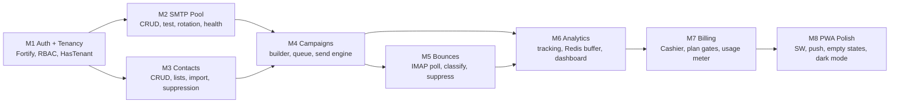

# 08 — Migration Plan: specimen1 → Laravel 13 SaaS

**Status:** Draft | **Source:** `/specimen1/` (frozen archive) | **Target:** greenfield Laravel 13 app in repo root

**Core principle:** This is a **rewrite informed by specimen1**, not a port. specimen1's value is its deliverability workflow knowledge (rotation, bounce handling, spin syntax, micro-batching); its code is single-tenant, GPL-encumbered licensing, and security-indebted. Nothing executes from specimen1 — ever.

---

## 1. Feature Parity Matrix

| specimen1 capability | Decision | Laravel 13 target | Priority |
|----------------------|----------|-------------------|:--------:|
| SMTP send via `fsockopen` (sequential) | **Rewrite** | Queue workers + Symfony Mailer, per-account connections, TLS-enforced | P0 |
| Multi-SMTP rotation | **Rewrite** | `SmtpPool::nextAccount()` — weighted by health_score, daily_limit aware, auto-failover | P0 |
| Micro-batched cron sending | **Rewrite** | Horizon lanes (`high`/`default`/`low`) + job chaining, no cron-file hacks | P0 |
| SQLite `AppDB` (single file) | **Rewrite** | Eloquent + PostgreSQL 17 + UUID v7 + row-scoped tenancy | P0 |
| Single-user auth | **Rewrite** | Fortify + Sanctum + 4-role RBAC | P0 |
| IMAP bounce polling + parsing | **Port logic** | `App\Actions\ProcessBounces` — DSN parse → hard/soft/complaint → suppress | P1 |
| Spin syntax `{a\|b}` | **Port logic** | `App\Actions\SpinContent` — recursive expansion, seeded per-recipient (stable variation) | P1 |
| Open/click tracking pixel + redirects | **Rewrite** | Redis-buffered HLL counters + batch PG flush (see Architecture §4.3) | P1 |
| Suppression on hard bounce | **Port logic** | Synchronous write to `suppression_entries` (hash-only) | P1 |
| CSV contact import | **Rewrite** | Async queue job, column mapping, row-error report, progress via cache | P1 |
| Alpine.js + Tailwind UI | **Evolve** | Blade components + Alpine 3 + Tailwind 4 (design system per PWA spec) | P0 |
| Campaign scheduling | **Port logic** | `scheduled_at` + scheduler dispatches send job | P1 |
| Rate throttling per SMTP | **Port logic** | `daily_limit` + `sent_today` counters, tenant-TZ midnight reset | P1 |
| License check → `tools.mywebvas.com` | **Drop** | Stripe subscription state (Cashier middleware) | — |
| GOD-MODE bypass (`elite_core_unlocked.php`) | **Delete** | Never ported, never distributed; history scrubbed pre-mirror | Immediate |
| Firewall / custom CSRF | **Drop** | Laravel middleware (built-in, audited) | — |
| Self-updater | **Drop** | Railway Git-push deploys | — |
| "Bypass spam filters" positioning | **Drop** | Rebranded: deliverability discipline (rotation + hygiene) | — |

**Parity acceptance:** a feature is "migrated" only when (a) it works end-to-end multi-tenant, (b) it has tests, (c) it meets the UX bar in the PRD.

---

## 2. Class → Target Mapping (20-not-200 style)

| specimen1 | Laravel 13 | Notes |
|-----------|-----------|-------|
| `AppDB` (raw SQLite wrapper) | Eloquent models + migrations | Zero raw SQL anywhere |
| `EliteSMTP` (400+ lines socket code) | `App\Actions\SendCampaignBatch` (invokable) + Symfony Mailer | ~30 lines of our code; Mailer does SMTP |
| `MessageBuilder` | `App\Actions\ComposeMessage` | spin expansion + tracking injection + unsubscribe header |
| `Security` / `Auth` | Fortify + Sanctum | Zero custom auth code |
| `Validator` | Form Requests | Declarative rules, no procedural checks |
| `Firewall` / `CSRF` | Laravel middleware | Deleted entirely |
| `UpdaterSecurity` | — | Deleted; SaaS deploys via CI |
| Inline HTML in `elite_core.txt` | Blade components per PWA spec | Full design system rebuild |

---

## 3. Data Migration (specimen1 → SaaS)

For early adopters running specimen1 self-hosted, a one-time import tool (v1.1) — **not** a launch blocker.

### 3.1 Mapping

| specimen1 (SQLite) | SaaS (PostgreSQL 17) | Transform |
|--------------------|----------------------|-----------|
| integer rowids | UUID v7 | Generated on import; old ID kept in `metadata.legacy_id` |
| `smtp_settings` plaintext password | `smtp_accounts.password` | Re-encrypted via `Crypt` at import |
| `queue` table rows | `campaign_recipients` | Status mapped: 0→pending, 1→sent, 2→failed |
| `contacts.email` plaintext | `contacts.email` + `email_hash` | SHA-256 generated alongside |
| suppression list | `suppression_entries` | Hash-only; plaintext discarded post-import |
| campaign stats columns | `campaigns.stats_cache` JSONB | Reshaped into read-model format |

### 3.2 Import flow
1. User uploads `database.sqlite` (never their credentials file)
2. Job validates schema version → streams tables → dedupes contacts by `email_hash`
3. Summary report: imported / skipped / failed per entity; nothing partial-committed (transaction per batch)

---

## 4. Build Order (dependency-driven)

### Per-module verification gates (must pass before next module)

| Module | Gate |
|--------|------|
| M1 | Register → login → tenant scoped queries proven by cross-tenant test suite |
| M2 | Send real email through 2 rotating accounts via Mailpit; failover kills bad account |
| M3 | 10k-row CSV imports async with progress; suppression excludes from send |
| M4 | 1k-recipient campaign completes via queue; pause/resume works; spin varies per recipient |
| M5 | Synthetic bounce mailbox → hard bounce suppressed within one poll cycle |
| M6 | Pixel hit → Redis → dashboard stat < 60s; zero PG writes on pixel path |
| M7 | Plan limit blocks send at 100 (Free); Stripe webhook upgrades limit live |
| M8 | Lighthouse PWA ≥95; offline fallback renders; push opt-in after first send |

---

## 5. Breaking Changes Register (specimen1 users → SaaS)

| Change | Impact | Mitigation |
|--------|--------|-----------|
| Self-hosted → hosted SaaS | No server access, no cron files | Import tool + onboarding wizard |
| Lifetime license → subscription | Cost model change | Grandfather pricing window (marketing decision) |
| Unlimited SMTP → plan caps | Plan limits | Overage = graceful pause + upgrade prompt, never silent failure |
| Plaintext config → encrypted secrets | Can't hand-edit config | UI manages all settings |
| GPL-licensed single file → proprietary SaaS | No source access | API + webhooks cover extensibility |

---

## 6. Rollback Strategy

- specimen1 remains frozen in `/specimen1/` — untouched, always revertible as reference
- SaaS is greenfield: **no in-place mutation of anything specimen1** → rollback = stop deploying
- Per-module gates mean a failed module never blocks prior shipped modules
- Database: every migration reversible (`down()` required, tested in CI)

---

## 7. Future-Proof Notes

- **Competitor importers (v3):** Mailchimp/Brevo CSV formats — import pipeline already mapping-driven
- **API-first sending (v2):** send engine is queue-native; transactional endpoint reuses M4 pipeline
- **Automation flows (v2):** `campaigns.settings.flow_id` reserved; domain events already emitted
